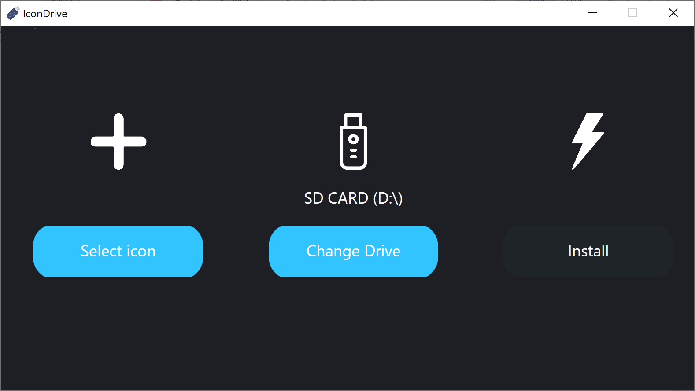
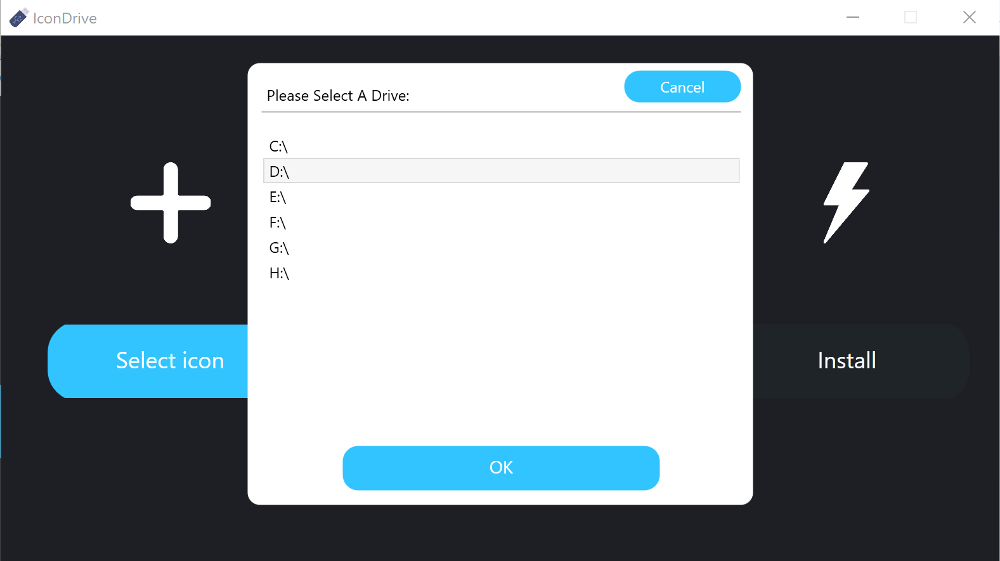

# IconDrive
This application is a simple custom USB icon installer created in C# using WPF. The purpose of this program is to function as a simple program to help users create custom USB icons as well as to continue my journey in learning WPF, specifically in stylizing.

## Prerequisites
This program requires no prerequisites

## Built With
This program was built with no external frameworks excluding the base C# system libraries.

## Authors
* **Shaan Khan** - *All Work*

## License
This project is licensed under the Mozilla Public License 2.0 - see the [LICENSE](https://github.com/ShaanCoding/IconDrive/blob/master/LICENSE) files for details
