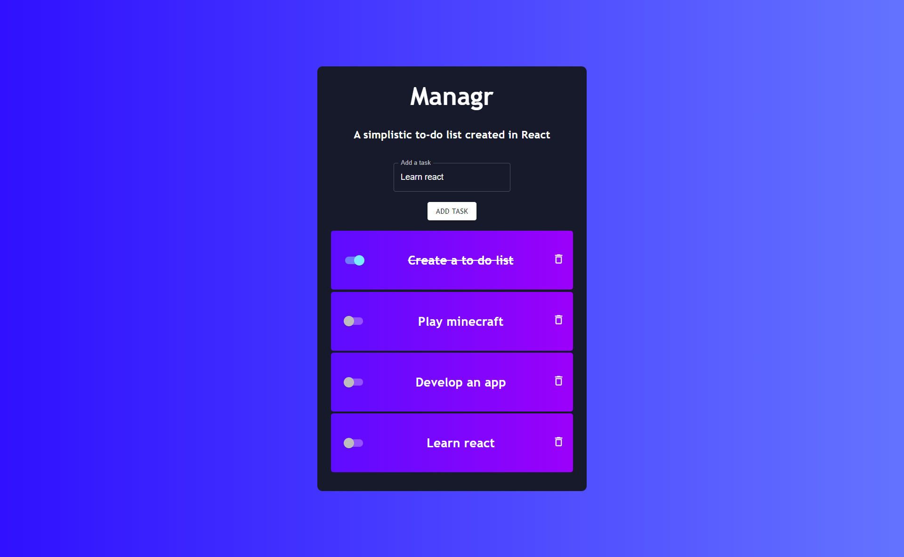

 

  

  <h3 align="center">Managr</h3>

  

    A React Based To-Do List.
     
     
    <a href="https://github.com/ShaanCoding/Managr"><strong>Explore the docs »</strong></a>
     
     
    <a href="https://github.com/ShaanCoding/Managr">View Demo</a>
    .
    <a href="https://github.com/ShaanCoding/Managr/issues">Report Bug</a>
    .
    <a href="https://github.com/ShaanCoding/Managr/issues">Request Feature</a>
  

   

## Table Of Contents

- [Table Of Contents](#table-of-contents)
- [About The Project](#about-the-project)
- [Built With](#built-with)
- [Getting Started](#getting-started)
  - [Prerequisites](#prerequisites)
- [Roadmap](#roadmap)
- [Contributing](#contributing)
  - [Creating A Pull Request](#creating-a-pull-request)
- [License](#license)
- [Authors](#authors)
- [Acknowledgements](#acknowledgements)

## About The Project

## Built With

This project was built with the core React & TypeScript libraries, in addition, it also uses:

* [Material-UI](https://material-ui.com/)
* [Emotion](https://emotion.sh/docs/introduction)

## Getting Started

### Prerequisites

* Yarn / NPM
* Emotion
* Material-UI
* TypeScript
* React

## Roadmap

See the [open issues](https://github.com/ShaanCoding/Managr/issues) for a list of proposed features (and known issues).

## Contributing

Contributions are what make the open source community such an amazing place to be learn, inspire, and create. Any contributions you make are **greatly appreciated**.
* If you have suggestions for adding or removing projects, feel free to [open an issue](https://github.com/ShaanCoding/Managr/issues/new) to discuss it, or directly create a pull request after you edit the *README.md* file with necessary changes.
* Please make sure you check your spelling and grammar.
* Create individual PR for each suggestion.
* Please also read through the [Code Of Conduct](https://github.com/ShaanCoding/Managr/blob/main/CODE_OF_CONDUCT.md) before posting your first idea as well.

### Creating A Pull Request

1. Fork the Project
2. Create your Feature Branch (`git checkout -b feature/AmazingFeature`)
3. Commit your Changes (`git commit -m 'Add some AmazingFeature'`)
4. Push to the Branch (`git push origin feature/AmazingFeature`)
5. Open a Pull Request

## License

Distributed under the MPL-2.0 License. See [LICENSE](https://github.com/ShaanCoding/Managr/blob/main/LICENSE.md) for more information.

## Authors

* **Shaan Khan** - *Comp Sci Student* - [Shaan Khan](https://github.com/ShaanCoding/) - *Built ReadME Template*

## Acknowledgements

* [ShaanCoding](https://github.com/ShaanCoding/)
* [Othneil Drew](https://github.com/othneildrew/Best-README-Template)
* [ImgShields](https://shields.io/)
