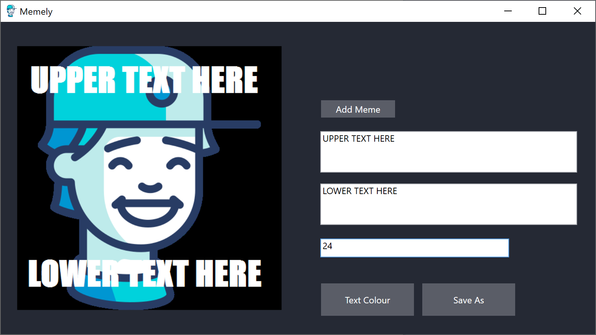

# Memely

This application is a program intended to act as a meme generator built in WPF as further practice in image manipulation, in addition to act as a tool to quickly generate memes without the use of online tools and thus no watermarks.

## Prerequisites
This program requires no prerequisites.

## Built With
This program was built with the base C# system libraries

## Authors
* **Shaan Khan** - *All Work*

## License
This project is licensed under the Mozilla Public License 2.0 - see the [LICENSE](https://github.com/ShaanCoding/Memely/blob/master/LICENSE) files for details
