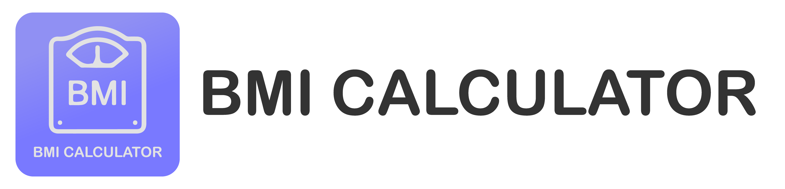

# BMI Calculator

    <b>An android body mass index calculator</b>

   

This application is a basic screen-recording software created in C# with the assistance of AnimatedGIF and the WindowsCodeAPI-Shell & Core libraries. This program was made as a clone alternative to Gyazo however saves them purely locally.

## Prerequisites

This program requires no prerequisties

## Authors

* **Shaan Khan** - *All Work*

## Acknowledgements

* None

## License

This project is licensed under the Mozilla Public License 2.0 - see the [LICENSE](https://www.github.com/ShaanCoding/BMI-Calculator/blob/master/LICENSE.md) files for details
