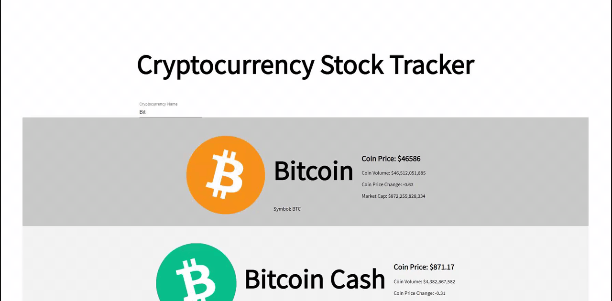

<br/>
<p align="center">
  <a href="https://github.com/ShaanCoding/React-Diary">
    
  </a>

  <h3 align="center">React Diary</h3>

  <p align="center">
    A diary application created in react.
    <br/>
    <br/>
    <a href="https://github.com/ShaanCoding/React-Diary"><strong>Explore the docs »</strong></a>
    <br/>
    <br/>
    <a href="https://github.com/ShaanCoding/React-Diary">View Demo</a>
    .
    <a href="https://github.com/ShaanCoding/React-Diary/issues">Report Bug</a>
    .
    <a href="https://github.com/ShaanCoding/React-Diary/issues">Request Feature</a>
  </p>
</p>

   

## Table Of Contents

- [Table Of Contents](#table-of-contents)
- [About The Project](#about-the-project)
- [Built With](#built-with)
- [Getting Started](#getting-started)
  - [Prerequisites](#prerequisites)
  - [Installation](#installation)
- [Roadmap](#roadmap)
- [Contributing](#contributing)
  - [Creating A Pull Request](#creating-a-pull-request)
- [License](#license)
- [Authors](#authors)
- [Acknowledgements](#acknowledgements)

## About The Project




## Built With

This project was built in React using Typescript.

* [React-Router-Dom](https://github.com/ReactTraining/react-router)
* [Material-UI](https://material-ui.com/)
* [React Simple MDE Editor](https://www.npmjs.com/package/react-simplemde-editor)
* [React Markdown](https://www.npmjs.com/package/react-markdown)

## Getting Started


### Prerequisites

To get this project started you need the following pre-requisite libraries:

- React-Router-Dom
- Material-UI
- React Simple MDE Editor
- React Markdown


### Installation

1. Clone the repo

```sh
git clone https://github.com/ShaanCoding/React-Diary.git
```

2. Install NPM packages

```ts
yarn add react-router-dom

yarn add @material-ui/core

yarn add --save react-simplemde-editor easymde

yarn add react-markdown
```

## Roadmap

See the [open issues](https://github.com/ShaanCoding/React-Diary/issues) for a list of proposed features (and known issues).

## Contributing

Contributions are what make the open source community such an amazing place to be learn, inspire, and create. Any contributions you make are **greatly appreciated**.
* If you have suggestions for adding or removing projects, feel free to [open an issue](https://github.com/ShaanCoding/React-Diary/issues/new) to discuss it, or directly create a pull request after you edit the *README.md* file with necessary changes.
* Please make sure you check your spelling and grammar.
* Create individual PR for each suggestion.
* Please also read through the [Code Of Conduct](https://github.com/ShaanCoding/React-Diary/blob/main/CODE_OF_CONDUCT.md) before posting your first idea as well.

### Creating A Pull Request

1. Fork the Project
2. Create your Feature Branch (`git checkout -b feature/AmazingFeature`)
3. Commit your Changes (`git commit -m 'Add some AmazingFeature'`)
4. Push to the Branch (`git push origin feature/AmazingFeature`)
5. Open a Pull Request

## License

Distributed under the MPL 2.0 License. See [LICENSE](https://github.com/ShaanCoding/React-Diary/blob/main/LICENSE.md) for more information.

## Authors

* **Shaan Khan** - *Comp Sci Student* - [Shaan Khan](https://github.com/ShaanCoding/) - *Built ReadME Template*

## Acknowledgements

* [ShaanCoding](https://github.com/ShaanCoding/)
* [Othneil Drew](https://github.com/othneildrew/Best-README-Template)
* [ImgShields](https://shields.io/)
