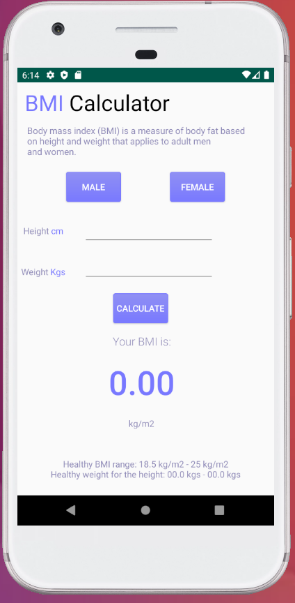

# 4SChan

This application is a basic 4chan thread image downloader created in C# with the assistance of NewtonSoft and the WindowsCodeAPI-Shell & Core. This program was made in order to bulk download image threads off 4chan such as desktop wallpaper dumps.

## Prerequisites

The running of this program requires several libaries these include:

* Newtonsoft.Json
* WindowsAPICodePack-Core
* WindowsAPICodePack-Shell

## Authors

* **Shaan Khan** - *All Work*

## License

This project is licensed under the Mozilla Public License 2.0 - see the [LICENSE](https://github.com/ShaanCoding/4SChan/blob/master/LICENSE) files for details
