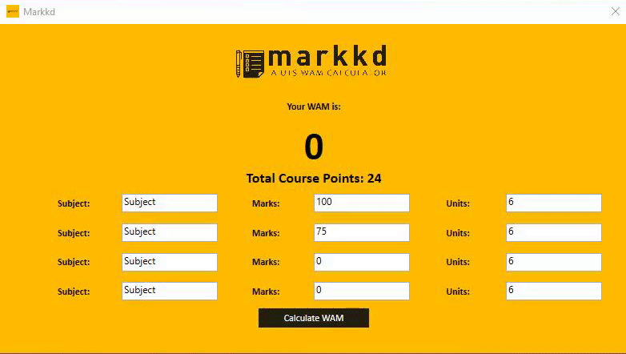

# Identicons

    <b> A lightweight WAM Calculator programmed in C# using WPF and the MVVM architecture. </b>

   

This application is a very basic WAM calculator created in C# using WPF and the MVVM architecture. This program was made in order to practice and learn the MVVM architecture design pattern and the relevant INotifyPropertyChanged and ICommand interfaces.

## Prerequisites

This program requires no additional libraries.

## Authors

* **Shaan Khan** - *All Work*

## Acknowledgements

* N/A

## License

This project is licensed under the Mozilla Public License 2.0 - see the [LICENSE](https://github.com/ShaanCoding/Markkd/blob/master/LICENSE.md) files for details
