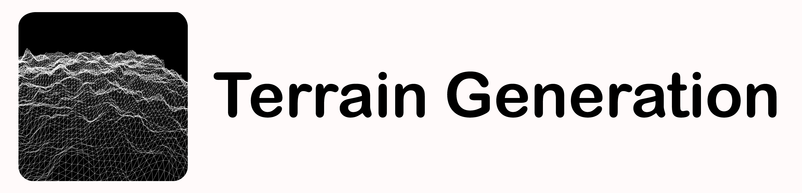

# TerrainGeneration

    <b> Procedural map generation in Processing using perlin noise. </b>

   

This application is an infinitely long procedural map generator, coding in Java using the Processing 3+ framework. This was made in order to understand the usages of Perlin Noise, in addition to map generation.

## Prerequisites

This program requires no additional libraries.

## Authors

* **Shaan Khan** - *All work*

## Acknowledgements

* **The Coding Train** - *Created a tutorial related to chunk generation as well as introductional videos to Processing.*

## License

This project is licensed under the Mozilla Public License 2.0 - see the [LICENSE](https://github.com/ShaanCoding/TerrainGeneration/blob/master/LICENSE.md) files for details
