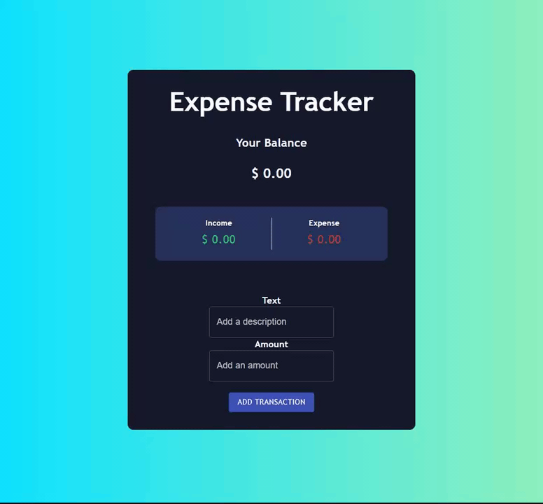

 

  

  <h3 align="center">Expense Tracker</h3>

  

    A simplistic expense tracker made in React using TypeScript
     
     
    <a href="https://github.com/ShaanCoding/ExpenseTracker"><strong>Explore the docs »</strong></a>
     
     
    <a href="https://github.com/ShaanCoding/ExpenseTracker">View Demo</a>
    .
    <a href="https://github.com/ShaanCoding/ExpenseTracker/issues">Report Bug</a>
    .
    <a href="https://github.com/ShaanCoding/ExpenseTracker/issues">Request Feature</a>
  

   

## Table Of Contents

- [Table Of Contents](#table-of-contents)
- [About The Project](#about-the-project)
- [Built With](#built-with)
- [Roadmap](#roadmap)
- [Contributing](#contributing)
  - [Creating A Pull Request](#creating-a-pull-request)
- [License](#license)
- [Authors](#authors)
- [Acknowledgements](#acknowledgements)

## About The Project

This is a simplistic expense tracker made in TypeScript using React in order to further learn the React framework. In this application, you can add and delete inputs of expenses and have them be displayed.

Features of this app include:
* Locally saving & loading
* Dynamic responsive layout
* Income & expenditure being automatically calculated
* Net income automatically calculated

## Built With

This project was built with the core React & TypeScript libraries, in addition, it also uses:

* [Material-UI](https://material-ui.com/)

## Roadmap

See the [open issues](https://github.com/ShaanCoding/ExpenseTracker/issues) for a list of proposed features (and known issues).

## Contributing

Contributions are what make the open source community such an amazing place to be learn, inspire, and create. Any contributions you make are **greatly appreciated**.
* If you have suggestions for adding or removing projects, feel free to [open an issue](https://github.com/ShaanCoding/ExpenseTracker/issues/new) to discuss it, or directly create a pull request after you edit the *README.md* file with necessary changes.
* Please make sure you check your spelling and grammar.
* Create individual PR for each suggestion.
* Please also read through the [Code Of Conduct](https://github.com/ShaanCoding/ExpenseTracker/blob/main/CODE_OF_CONDUCT.md) before posting your first idea as well.

### Creating A Pull Request

1. Fork the Project
2. Create your Feature Branch (`git checkout -b feature/AmazingFeature`)
3. Commit your Changes (`git commit -m 'Add some AmazingFeature'`)
4. Push to the Branch (`git push origin feature/AmazingFeature`)
5. Open a Pull Request

## License

Distributed under the MPL-2.0 License. See [LICENSE](https://github.com/ShaanCoding/ExpenseTracker/blob/main/LICENSE.md) for more information.

## Authors

* **Shaan Khan** - *Comp Sci Student* - [Shaan Khan](https://github.com/ShaanCoding/) - *Created project*

## Acknowledgements

* [ShaanCoding](https://github.com/ShaanCoding/)
* [Othneil Drew](https://github.com/othneildrew/Best-README-Template)
* [ImgShields](https://shields.io/)
