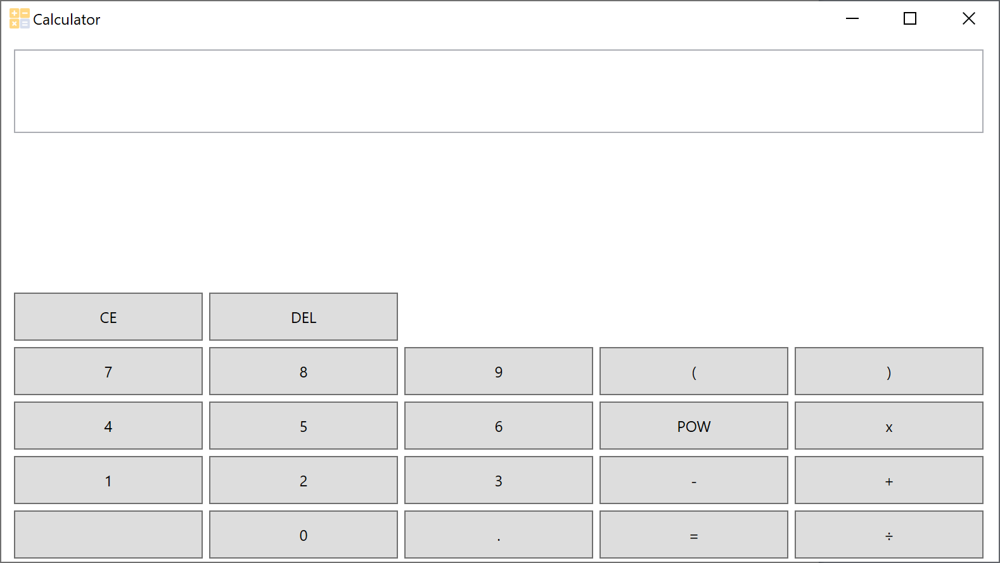

# Scientific Calculator
This application is a simple scientific calculator coded in C# using WPF.
The purpose of this program is to act as a simple lightweight calculator, using reverse polish notation and the shunting yard algorithm. This application is a further / alternative version of the Boolean expression solver and therefore uses the same logic behind it.

## How To Use
This program functions like a normal scientific calculator, to use this application:
1. Click on a number you wish to add
2. Select a operation
3. Repeat until you've created your desired expression then press "=" to solve the expression.

### Examples Of Expression
A example of an expression would be:
(2 + 1) * 3 / 4 - 1

## Prerequisites
This program requires no prerequisites

## Built With
This program was built with no external frameworks excluding the C# system libraries, all additional libraries included, such as the maths class was created by me, Shaan Khan.

## Authors
* **Shaan Khan** - *All Work*

## License
This project is licensed under the Mozilla Public License 2.0 - see the [LICENSE](https://github.com/ShaanCoding/Scientific-Calculator/blob/master/LICENSE) files for details
