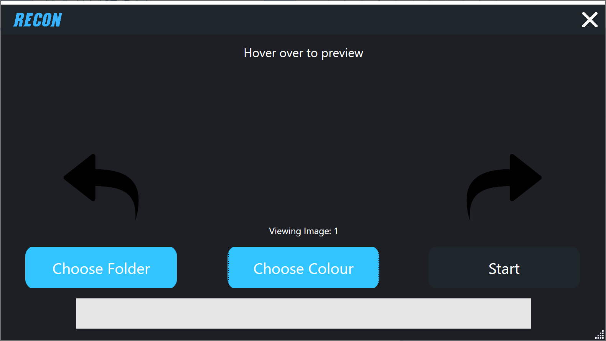
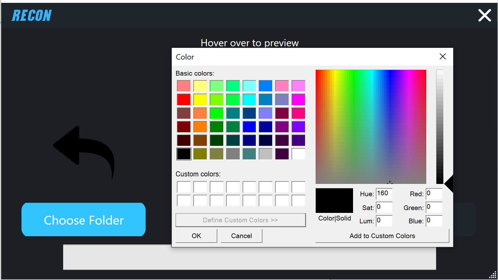

# reCON
This application is program intended for developers to bulk edit colors for icons and other assets. During the development phase, especially when creating buttons and other UI/UX elements developers often need to reskin single color assets. This program takes out the repetitive task of editing each image by making an automated tool that automatically edits every image automatically. Just place the image in a folder, specify a color and press start.

## Prerequisites
This program requires no prerequisites.

## Built With
This program was built with the base C# system libraries as well as the Microsoft WindowsAPICodePack available on NuGet.

## Authors
* **Shaan Khan** - *All Work*

## License
This project is licensed under the Mozilla Public License 2.0 - see the [LICENSE](https://github.com/ShaanCoding/reCON/blob/master/LICENSE) files for details
